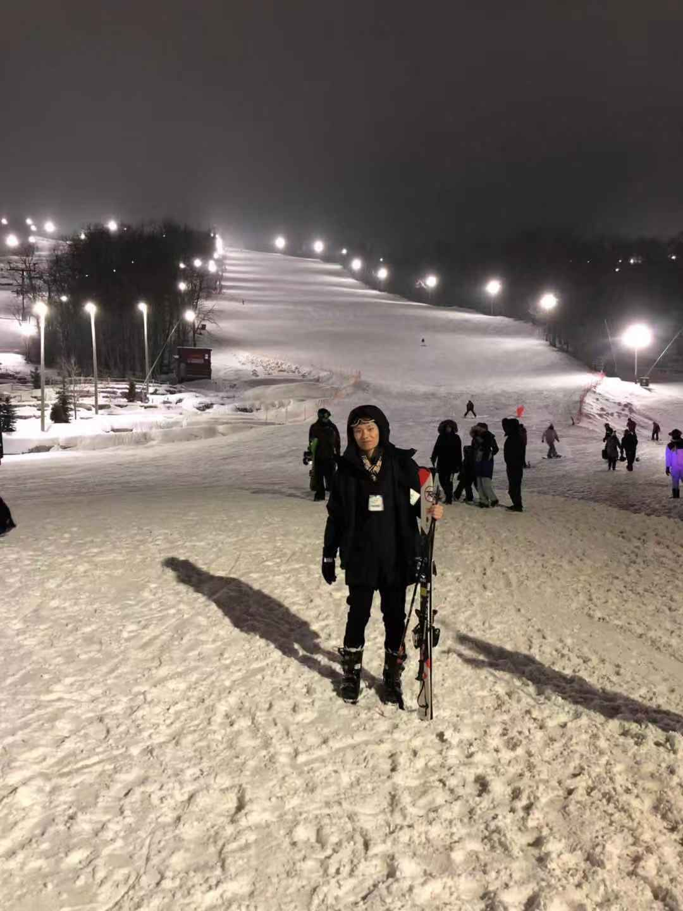

Been looking forward to this Blue Mountain skiing trip for a while. Beautiful weather, lovely hotel, life doesnt get any better than this... Right?

## Until

After about an hour waiting in line for our skiing equipment, we are finally ready to go. Holy cow I didn't expect skiing to be this hard. The gentlemen I asked said lift will take me straight to newbie area :flushed:. The view on lift was nice, but the other end of lift was expert lanes with about 40 degree descent.

## The ride

I lost count of how many times I fall over spinning on the track. During two of these I even lost my poles, if it wasn't for the riders behind me passing me my poles I don't know how else am I going to make it to the bottom :sweat:. I'm sure these 30 minutes will be my life time memory :(
