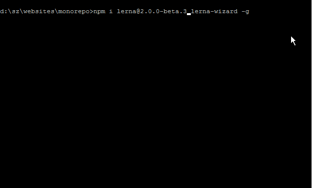

### 前言

相信很多同学都遇到过一个问题：随着 js 项目越来越大，许多公用的功能与组件往往会被拆分，打包，发布成为单独的 npm 包来使用，而在此过程中，往往会遇到不少问题：

1. 如需修改拆分的包往往会需要`npm link`或者`git submodule`，适用性和观感很差
2. `commit log`分散在各个仓库中，问题溯源成本大大提升
3. 包发布需要去各个仓库操作，相当繁琐
4. 最常用的包改动后会影响大量依赖此包的项目，（ps 改动 package.json 等），有时候还有会遗漏

这时候，聪明的同学就会想到，我们把所有的代码全部移到一个仓库里去不就好了吗？是的，程序员的力量是无穷的，业界已经为我们提供了相当成熟的解决方案，那就是用: [lerna](https://lerna.js.org/) 来管理你的仓库

> 有阅读源码习惯的同学可能已经对 lerna 不再陌生，例如 react，vue 等等大型项目都已经在开发环境中使用 lerna 来管理 npm 包

<br/>

### 什么是 lerna

Lerna 是一种工具，可以优化使用 git 和 npm 管理多包仓库的工作流程。

> 将大型代码库分成单独的独立版本化的软件包对于代码共享非常有用。但是，跨仓库进行更改很麻烦且难以跟踪，并且跨仓库的测试变得非常复杂。为了解决这些（以及许多其他）问题，某些项目会将其代码库组织到多包存储库中。Babel，React，Angular，Ember，Meteor，Jest 等项目以及许多其他项目都在单个仓库中开发了所有软件包。
> <br/>

### 安装

首先全局安装 lerna

```
npm install --global lerna
```

<br/>

### 初始化

接下来新建一个 git 仓库

```
mkdir my-new-monorepo && cd my-new-monorepo
```

初始化 lerna 和 git

```
lerna init
git init
```

进行完这个步骤后，仓库应该大致长这样：

```
my-new-monorepo/
  package.json
  lerna.json
  packages/
    package-1/
      package.json
    package-2/
      package.json
```

接下来，就是见证奇迹的时刻，你只需要根据你的每个子项目分别运行

```
lerna import ~/path/to/your/subproject

```

剩下的都由 lerna 来为你搞定！包括迁移代码，迁移 git 提交日志，将他们移动到 packages/目录下，并修改`lerna.json`

仓库添加完毕之后运行 `lerna bootstrap` 来安装项目依赖
<br/>

### lerna 的命令

- `lerna init`: 如其名
- `lerna bootstrap`: 初始化仓库中的所有 package，包括安装依赖，运行 preinstall，postinstall script 等等
- `lerna import`： 导入一个本地存在的仓库成为一个新的 package
- `lerna add [package]`：添加所有子项目都可用的共同依赖
- `lerna publish`：打包发布所有的 package
  - 选项：`--npm-tag [tagname]` 用指定的 npm tag 发布包，默认为 latest
  - `--canary 或 -c` 发布一个 canary(测试)版本
  - `--skip-git` 不执行任何 git 命令
  - `--force-publish [packages]` 强制发布数组中列举的 package，用逗号分割，或者`*`来发布所有包
- `lerna changed` 查看和上次发布相比哪些 package 产生了改动
- `lerna ls` 列举该仓库中所有公开可见的 package
- `lerna run [script]` 等同于在所有 package 中运行`npm run [script]`，前提是该 script 存在
  <br/>

### lerna.json 配置

- version: 当前 npm 包的版本
- npmClient: 默认是 "npm".
- command.publish.ignoreChanges: 在运行`lerna changed`和`lerna publish`时会被忽略的 glob 匹配项，用来防止因为修改例如`README.md`后生成一个新版本
- command.publish.message: 一个在发布新版本时会作为前缀添加到 commit 消息的配置项
- command.publish.registry: 指定发布到的 npm 源
- command.bootstrap.ignore: 一个记录 bootstrap 过程中哪些 package 会被忽略的 glob 匹配项数组
- command.bootstrap.npmClientArgs: 会作为参数传给 npm 客户端, 例如`--no-package-lock`
- packages: lerna 用来标注 package 的 glob 匹配项数组， 默认为`packages/*`
  <br/>

### 懒癌患者的救星

如果你觉得记得这么多的配置项和命令实在太难了，[lerna-wizard](https://github.com/webuniverseio/lerna-wizard)就是你的救星。且看 demo：



<br/>

### 潜在问题/缺陷

- 为项目添加了一层额外的复杂度，开发者需要了解 monorepo 的概念和 lerna 的使用
- 没有一个可用的 dry-run 选项，无法在不往 npm 发布包的情况下测试整个 publish 流程
- 定义不同 npm 包之间公用的生命周期脚本比较困难
- 仅改动一小部分代码也需要克隆整个 monorepo 和安装所有依赖
